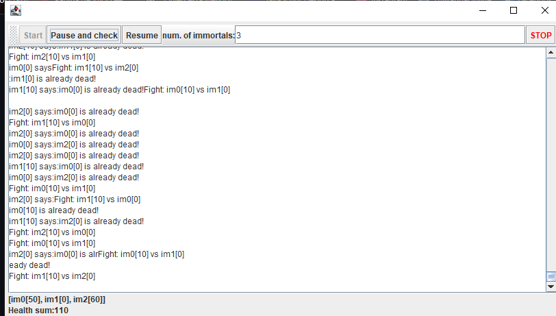

# **Concurrent Programming and Synchronization Exercises – Software Architectures**

## **Description**

This repository contains a set of practical exercises focused on concurrent programming, race conditions, thread synchronization, 
and deadlock prevention, developed as part of the Software Architectures course at the Escuela Colombiana de Ingeniería Julio Garavito.

The exercises are implemented in Java and explore key concepts such as the producer-consumer pattern using wait/notify, 
shared data synchronization across threads, and thread coordination in high-concurrency simulations. Students analyze CPU usage,
 detect and fix concurrency issues, and implement efficient, thread-safe solutions using Java concurrency utilities.

## **Authors**

- **Santiago Hurtado Martínez** [SantiagoHM20](https://github.com/SantiagoHM20)

- **Mayerlly Suárez Correa** [mayerllyyo](https://github.com/mayerllyyo)

###  **Part I: Producer / Consumer – Thread Control with wait/notify**

#### Review the operation of the program and execute it. While this is happening, run jVisualVM and check the CPU consumption of the corresponding process. What is causing this consumption? Which class is responsible?


We identify that 21.4% was the highest consume of CPU, and that consume was from the Main class "StartProduction"

but also, Consumidor class is requesting all iterations if the queue isn't empty, that increments complexity


```java

@Override
    public void run() {
        while (true) {

            if (queue.size() > 0) { //Here
                int elem=queue.poll();
                System.out.println("Consumer consumes "+elem);                                
            }
            
        }
    }
```

In addition, it doesn't implement a thread-safe Queue and its methods. However, the Productor class doesn't implement it either.

However Productor class doesn't have a functional use to the limit un the queue, so it doesn't matter the limit Main class puts.

#### Make the necessary adjustments so that the solution uses the CPU more efficiently, considering that - for now - production is slow and consumption is fast. Verify with JVisualVM that CPU consumption is reduced.


In Productor class:

```java

public Producer(LinkedBlockingQueue<Integer> queue,long stockLimit) {
        this.queue = queue;
        rand = new Random(System.currentTimeMillis());
        this.stockLimit=stockLimit;
    }

    @Override
    public void run() {
        try{
            while (true) {

                if(queue.size() < stockLimit) {

                    dataSeed = dataSeed + rand.nextInt(100);
                    System.out.println("Producer added " + dataSeed);
                    queue.put(dataSeed);


                    Thread.sleep(1000);
                }
                else{
                    System.out.println("Limit reached" + stockLimit + "Producer Waiting...");
                }
            }
        }catch (InterruptedException ex) {
                Logger.getLogger(Producer.class.getName()).log(Level.SEVERE, null, ex);
                System.out.println("Producer Interrumpted");
                Thread.currentThread().interrupt();
        }

    }


```
In Consumidor class:

```java
public Consumer(LinkedBlockingQueue<Integer> queue){
        this.queue=queue;        
    }
    
    @Override
    public void run() {
        try {
            while (true) {
                int elem = queue.take();
                System.out.println("Consumer consumes " + elem);
            }
        } catch (InterruptedException e) {
            System.out.println("Consumer interrupted");
        }
    }
```

In both classes we adjust the data structure to manage a LinkedBlockingQueue, using its methods and handling its exceptions.
In adition, we made use of stockLimit in Productor class.


#### Make the necessary adjustments so that the producer generates items quickly, and the consumer consumes them slowly, 
while enforcing a stock limit. Verify with JVisualVM that CPU consumption remains low even with a small stock capacity.

**In `Producer` class:**

```java
public Producer(LinkedBlockingQueue<Integer> queue, Integer stockLimit) {
    this.queue = queue;
    rand = new Random(System.currentTimeMillis());
    this.stockLimit = stockLimit;
}

@Override
public void run() {
    try {
        while (true) {
            if (queue.size() < stockLimit) {
                dataSeed = dataSeed + rand.nextInt(100);
                System.out.println("Producer added " + dataSeed);
                queue.put(dataSeed);

                Thread.sleep(10); // fast production
            } else {
                System.out.println("Limit reached " + stockLimit + " - Producer waiting...");
            }
        }
    } catch (InterruptedException ex) {
        Logger.getLogger(Producer.class.getName()).log(Level.SEVERE, null, ex);
        System.out.println("Producer Interrupted");
        Thread.currentThread().interrupt();
    }
}
```

**In `Consumer` class:**

```java
public Consumer(LinkedBlockingQueue<Integer> queue){
    this.queue = queue;
}

@Override
public void run() {
    try {
        while (true) {
            int elem = queue.take();
            System.out.println("Consumer consumes " + elem);
            
            Thread.sleep(1000); // slow consumption
        }
    } catch (InterruptedException e) {
        System.out.println("Consumer interrupted");
    }
}
```

In both classes, we use LinkedBlockingQueue as the shared buffer, leveraging its thread-safe and blocking capabilities.

- The **producer** attempts to generate new elements rapidly (Thread.sleep(10)).
- The **consumer** simulates a slower consumption rate (Thread.sleep(1000)).
- A stockLimit is enforced by checking the current size of the queue before inserting new items.


 **CPU usage verified with JVisualVM:**

Despite having a **small stock limit**, the producer does not cause high CPU usage, as shown in the graph below.


This confirms that our solution behaves efficiently under constrained buffer sizes and asynchronous production/consumption rates.

### *Part II - Distributed Search and Synchronization*


### *Part III*

#### Review the “highlander-simulator” program, available in the edu.eci.arsw.highlandersim package. This is a game in which:

- There are N immortal players.
- Each player knows the remaining N-1 players.
- Each player constantly attacks another immortal. The first player to attack subtracts M hit points from their opponent and increases their own hit points by the same amount.
- The game may never have a single winner. Most likely, only two will remain in the end, fighting indefinitely, subtracting and adding hit points.


#### Review the code and identify how the aforementioned functionality was implemented. Given the game's intent, an invariant should be that the sum of all players' hit points should always be the same (obviously, at a time point when a time increment/decrement operation is not in progress). In this case, for N players, what should this value be?

The value for N players must be N * health
(inital health of 1 immortal)

This functionality occurs in these methods of the immortal.java class:

```java

public void run() {

        while (true) {
            Immortal im;

            int myIndex = immortalsPopulation.indexOf(this);

            int nextFighterIndex = r.nextInt(immortalsPopulation.size());

            //avoid self-fight
            if (nextFighterIndex == myIndex) {
                nextFighterIndex = ((nextFighterIndex + 1) % immortalsPopulation.size());
            }

            im = immortalsPopulation.get(nextFighterIndex);

            this.fight(im);

            try {
                Thread.sleep(1);
            } catch (InterruptedException e) {
                e.printStackTrace();
            }

        }

    }

    public void fight(Immortal i2) {

        if (i2.getHealth() > 0) {
            i2.changeHealth(i2.getHealth() - defaultDamageValue);
            this.health += defaultDamageValue;
            updateCallback.processReport("Fight: " + this + " vs " + i2+"\n");
        } else {
            updateCallback.processReport(this + " says:" + i2 + " is already dead!\n");
        }

    }

```

Run the application and check how the 'pause' and 'check' options work. Is the invariant true?

1st click:



2st click:


3st click:


Conclution, The invariant is not being fulfilled, the value is altered with each click

#### A first hypothesis for the race condition to arise for this function (pause and check) is that the program consults the list whose values ​​it will print, while other threads modify their values. To correct this, do whatever is necessary to effectively pause all other threads before printing the current results. Additionally, implement the 'resume' option.


We added the variables paused and isActuallyPaused

Then, created the methods pause and resumeImmortal in Immortal.java

```java

    public void pause(){
        paused=true;

    }
    public void resumeImmortal(){
        paused = false;
        IsActuallyPaused=false;
        synchronized(this){
            notifyAll();
        }
    }
```

Then we called pause in the run method:

```java

    if(paused){
        synchronized(this){
            try {
                IsActuallyPaused=true;
                wait();
            } catch (Exception e) {
                e.printStackTrace();
            }
        }
    }

```

And finally the implementations y ControlFrame.java:

```java
    JButton btnPauseAndCheck = new JButton("Pause and check");
    btnPauseAndCheck.addActionListener(new ActionListener() {
        public void actionPerformed(ActionEvent e) {

            /*
                * COMPLETAR
                */
            int sum = 0;
            for (Immortal im : immortals) {
                im.pause();
            }

            boolean allPaused;
            do {
                allPaused = true;
                for (Immortal im : immortals) {
                    if (!im.IsActuallyPaused) {
                        allPaused = false;
                    }
                }
            } while (!allPaused);
            
            for (Immortal im : immortals) {
                sum += im.getHealth();
            }
            

            statisticsLabel.setText("<html>"+immortals.toString()+"<br>Health sum:"+ sum);
        
        }
    });


    JButton btnResume = new JButton("Resume");

    btnResume.addActionListener(new ActionListener() {
        public void actionPerformed(ActionEvent e) {
            /**
             * IMPLEMENTAR
             */

            for (Immortal im : immortals) {
                im.resumeImmortal();
            }

        }
    });


```

#### Check the operation again (click the button several times). Is the invariant fulfilled or not?

1st click:


2nd click:


the invariant does not hold

#### Identify potential critical regions regarding the immortals' fight. Implement a locking strategy that avoids race conditions.

When pausing/resume there are race conditions in the fight method and the way health is updated.

```java

public void fight(Immortal i2) {

    if (i2.getHealth() > 0) {
        i2.changeHealth(i2.getHealth() - defaultDamageValue);
        this.health += defaultDamageValue;
        updateCallback.processReport("Fight: " + this + " vs " + i2+"\n");
    } else {
        updateCallback.processReport(this + " says:" + i2 + " is already dead!\n");
    }

    }

```

This is the new 'fight' method to avoid race conditions:

```java

public void fight(Immortal i2) {
    Immortal first = this;
    Immortal second = i2;

        if (first.name.compareTo(second.name) > 0) {
            first = i2;
            second = this;
        }

        synchronized (first) {
            synchronized (second) {
                if (i2.getHealth() > 0) {
                    i2.changeHealth(i2.getHealth() - defaultDamageValue);
                    this.health += defaultDamageValue;
                    updateCallback.processReport("Fight: " + this + " vs " + i2 + "\n");
                } else {
                    updateCallback.processReport(this + " says:" + i2 + " is already dead!\n");
                }
            }
        }
    }

```

Now the invariant is fulfilled correctly

1st click:


2nd click:


3rd click:


For 100 Immortals:


For 1000 Immortals:


For 10000 Immortals:


#### Analyzing the functioning scheme of the simulation, could this create a race condition? Implement the functionality, run the simulation and observe what problem arises when there are many 'immortals' in it. Write your conclusions about it in the RESPUESTAS.txt file.

#### Correct the previous problem WITHOUT using synchronization, since making sequential access to the shared list of immortals would make the simulation extremely slow.

**Race Condition Analysis:**

YES, removing dead immortals from the shared list creates race conditions because:

- Multiple threads simultaneously access the `immortalsPopulation` list
- Some threads read the list to select opponents (in `run()` method)
- Other threads modify the list by removing dead immortals (in `fight()` method)
- This can cause `IndexOutOfBoundsException` or `ConcurrentModificationException`

**Evidence of the Problem:**

When running the simulation with many immortals (10-15), the following issues were observed:
- `IndexOutOfBoundsException` when a thread tries to access an index that no longer exists
- `ConcurrentModificationException` when the list is modified while another thread is iterating over it
- Inconsistencies in list size

**Solution Implemented (WITHOUT Synchronization):**

Instead of directly removing dead immortals from the list, we implemented a "mark as dead" strategy:

1. **State Variable:**
   ```java
   public volatile boolean isDead = false;
   ```

2. **Mark as Dead:**
   ```java
   if(i2.getHealth()<=0){
       i2.isDead = true; // Only mark, don't remove
   }
   ```

3. **Check Before Fighting:**
   ```java
   if (!im.isDead) {
       this.fight(im);
   }
   ```

4. **Thread Termination:**
   ```java
   public void run() {
       while (true) {
           if (this.isDead) {
               break; // Terminate thread execution
           }
           // ... rest of the code
       }
   }
   ```

**Advantages of the Solution:**
- **Eliminates Race Conditions:** No modification of shared list structure
- **Better Performance:** No fights with dead immortals, dead threads stop consuming CPU
- **Thread-Safe:** Uses volatile variables for visibility between threads
- **Efficiency:** Dead immortals are automatically excluded from future fights

**Conclusions:**
1. Direct removal of elements from shared lists in concurrent environments always creates race conditions
2. The "mark as dead" strategy is more efficient than synchronization for this type of problem
3. Using volatile variables is sufficient for this case, as only state is modified, not the shared data structure
4. This solution maintains high concurrency without sacrificing program correctness
5. Dead threads self-eliminate from the simulation without affecting other threads
